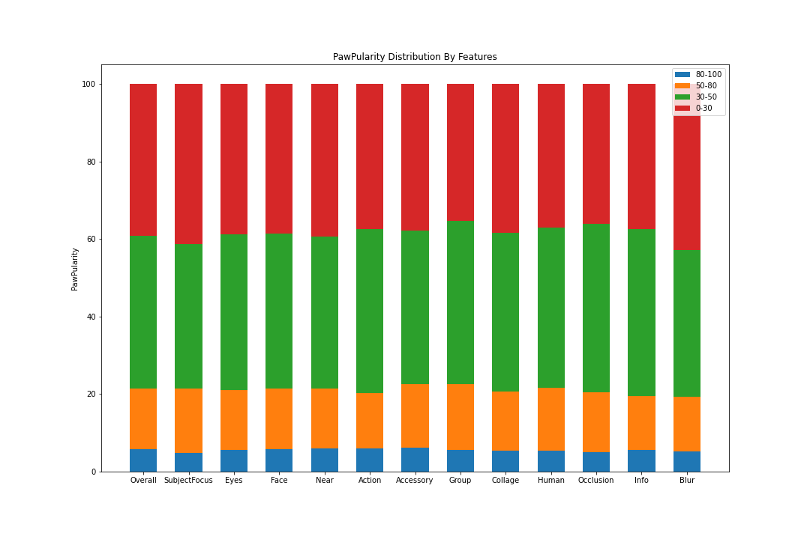

# IDS2021-ProjectC8-PetPopularity
Our plan was to take multiple different approaches to the problem. Main goals for the end-result were to create a model that could predict the pet picture popularity score as well as possible, try out different model creation frameworks and to perhaps propose a way to augment the data so that the models could be better in the future.

The first was to use the modeling algorithms we learned about in class to take the simplest path to the result as possible, the **basic approach**. This meant building different models on the data available and seeing which one performed the best. 

The second was to use an image recognition framework to "recognize" the popularity of the photos using **YOLOv5**.

Then originally it was planned to augment that recognition model by splitting the data by dogs and cats and training the popularity recognition separately on them. However, since the recognition model approach did not work, this was binned and other methods were explored.

So an **image classifie**r was created with Tensorflow using this guide. This approach did not yield any better results and it was decided that the images might not have enough data to be extracted from them, or the model was not succeeding in extracting the data.

Finally a **structured data classifier** was created with Tensorflow by following this guide. This yielded the best result other than the **basic approach**.

## Basic approach
In basic approach, we first tried to findout which feature or features impacting mostly to the popularity score. To get that we calculated percentage of score lies between several categories like 80-100, 50-80, 30-50 & 0-30 depending on having a feature. 

With this approach we got following distribution:

From this distribution, we can not find very notable impact of specific feature or features. However, it has been seen that with the addition of accessories, SubjectFocus and Blur, popularity score is kind of impacted either positively or negatively. 

We had decided to train basic models with those features individually, combinedly and with all features. And we used KNN, RandomForest, DecisionTree & SVM classifiers. 

### Spliting the data
We have splited the train dataset provided into 90% training set, 5% validation set and 5% test set. 

### Train the models
Then we start the training process with training set for various classifiers and also tried to optimize the classifiers parameters, for example neighbour size for knn and depth for RandomForest. We also measured RMSE and kept the record of the performance of various models. 

Our Model VS RMSE plot is like below:

## Attempted YOLOv5
YOLOv5 was selected since one of the teammembers already was familiar with it so training could be started quickly. The YOLOv5s model was selected as an entry point. Official documentation was followed to label and format the data into a YOLOv5 format.

The model was trained on the dataset for 200 epochs overnight with a batch size of 16. This did not yield good results with MAP around 0.1.

Here are the MAP results for the YOLOv5 model.

MAP below 50%

MAP >50%

## Image classifier
Since YOLOv5 did not succeed it was thought that maybe image recognition was not suitable to approach this problem. Thus an image classifier was created using the Tensorflow library. This trained much faster but only reached a maximum of ~26% accuracy. So it was thought maybe the images simply did not have enough data available to be extracted by the classifier and an image metadata based classifier was created as a final approach.

Here are the training metrics for the image classifier.

## Structured classifier
The structured data classification is similar to the **basic approach** with the exception that the model is defined by the creators. It was hoped that this would yield better results because of customisability. However, this was not the case, and despite testig all the available activation and optimizer functions available on Tensorflow, the best result yielded was the RMSprop optimiser and the RELU activation function, ~28.5% accuracy with RMSE of ~27%.

Here are the training metrics from the first set of 100 epochs which turned out to be enough to reach the max possible accuracy of the model.

