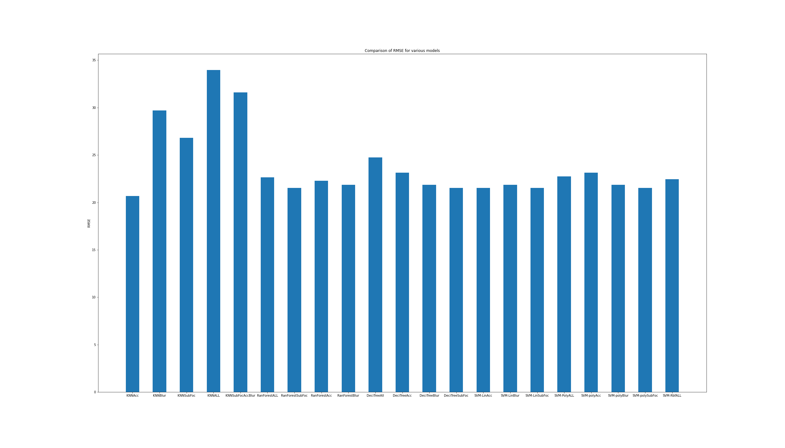

# IDS2021-ProjectC8-PetPopularity
Our plan was to take multiple different approaches to the problem. Main goals for the end-result were to create a model that could predict the pet picture popularity score as well as possible, try out different model creation frameworks and to perhaps propose a way to augment the data so that the models could be better in the future.

The first approach was to use the modeling algorithms we learned about in class to take the simplest path to the result as possible, the **basic approach**. This meant building different models on the data available and seeing which one performed the best. 

The second was to use an image recognition framework to "recognize" the popularity of the photos using **YOLOv5** following this [guide](https://github.com/ultralytics/yolov5/wiki/Train-Custom-Data).

Then originally it was planned to augment that recognition model by splitting the data by dogs and cats and training the popularity recognition separately on them. However, since the recognition model approach did not work, this was binned and other methods were explored.

So an **image classifier** was created with Tensorflow using this [guide](https://www.tensorflow.org/tutorials/images/classification). This approach did not yield any better results and it was decided that the images might not have enough data to be extracted from them, or the model was not succeeding in extracting the data.

Finally a **structured data classifier** was created with Tensorflow by following this [guide](https://www.tensorflow.org/tutorials/structured_data/preprocessing_layers). This yielded the second best result after the **basic approach**.

We estimate around 60-70h between the two authors to complete all of these approaches and visualize some results.

# Basic approach
In basic approach, we first tried to findout which feature or features impacting mostly to the popularity score. To get that we calculated percentage of score lies between several categories like 80-100, 50-80, 30-50 & 0-30 depending on having a feature. 

With this approach we got following distribution:

From this distribution, we can not find very notable impact of specific feature or features. However, it has been seen that with the addition of accessories, SubjectFocus and Blur, popularity score is kind of impacted either positively or negatively. 

We had decided to train basic models with those features individually, combinedly and with all features. And we used KNN, RandomForest, DecisionTree & SVM classifiers. 

### Spliting the data
We have splited the train dataset provided into 90% training set, 5% validation set and 5% test set. 

### Train the models
Then we start the training process with training set for various classifiers and also tried to optimize the classifiers parameters, for example neighbour size for knn and depth for RandomForest. We also measured RMSE and kept the record of the performance of various models. 

Our Model VS RMSE plot is like below:

From this plot, we can see none of the models are very impressive but our aim is to select as good as we can. And we can see, KNN with accessories only, gives the lowest RMSE value where as RandomForest, DecisionTree and SVM models are good with Accessories, Subject focus and Blur. If we consider all the features then RandomForest is the best model so far.

Then we tried to train, KNN with Accesories, RandomForest with Subject Focus, Blur & All features with training and validation set (more data) and measure RMSE with test set. However, it turns out that training with more data doesn't improve the model and some cases worsen it.

We think, this is because of bad data and needs a good cleanup/augmentation of the data. However, its not possible to determine the popularity score by checking the image with human eye, especially since the features provided with the metadata seem arbitrarily selected.

So, we have decided to train the model with less data by random split and continue this process until we get our target RMSE with the test data. When we reach our target RMSE then we tried to lower the target and continue the process. 

This way we have get our best KNN with Accessories feature, best RandomForest with All features and best RandomForest with Subject Focus and Blur.

Still the models we got is not impressive but its little improved and RandomForest with All features shows consitency while testing with random data. 

In the future these models could be trained further on some better data.

# Neural network approaches 
For these approaches to the solution of the competition problem, instead of rating the animals from 0-100, the ratings were transformed into 11 classes from 0-10 that would then be predicted by the models. Only the best performing model, the structured data classifier, was coded a proper output for, where the score from 0-10 was transformed back into 0-100 based on the certainty of the prediction. The value of this extrapolation based on certainty is dubious but hopefully better than assigning randomly.

## Attempted YOLOv5
YOLOv5 was selected since one of the teammembers already was familiar with it so training could be started quickly. The YOLOv5s model was selected as an entry point. Official documentation was followed to label and format the data into a YOLOv5 format.

The model was trained on the dataset for 200 epochs overnight with a batch size of 16. This did not yield good results with MAP around 0.1.

Here are the MAP results for the YOLOv5 model.

### MAP below 50%

### MAP >50%

## Image classifier
Since YOLOv5 did not succeed it was thought that maybe image recognition was not suitable to approach this problem. Thus an image classifier was created using the Tensorflow library. This trained much faster but only reached a maximum of ~26% accuracy.

Here are the training metrics for the image classifier.

So it was thought maybe the images simply did not have enough data available to be extracted by the classifier and an image metadata based classifier was created as a final approach.

## Structured classifier
The structured data classification is similar to the **basic approach** with the exception that the model is defined by the creators. It was hoped that this would yield better results because of customisability. However, this was not the case, and despite testing all the available activation and optimizer functions available on Tensorflow, the best result yielded was the RMSprop optimiser and the RELU activation function, ~28.5% accuracy with RMSE of ~27%.

Here are the training metrics from the first set of 100 epochs which turned out to be enough to reach the max possible accuracy of the model.

Another possibility to augment this model would be to optimize hyperparameters, but the time allocated for this project was not enough to explore this.

# Completion of goals
Our stated goals were:

Goal 1: Predicting popularity score of the photos.

  - This was completed as best as was possible based on the provided dataset, although it was found out that the data was too uniform to accurately predict from.

Goal 2: Find better evaluation criteria.

  - Better proposed evaluation criteria would be to simply rate the photos for cuteness since that is essentially what we believe determines their popularity.

Goal 3: Propose new scoring method.

  - The new scoring method would be a 0-10 rating for cuteness, providing an easier entry point for learning models and requiring less work to compile a dataset.

Goal 4: Find features that relate to the score.

  - It was found that only very few features marginally relate to the score, meaning that the data was very uniform and impossible to accurately learn from.

# Conclusion
After testing out many different approaches to solving the popularity prediction problem, it seems that the data uniformity, that was apparent from graph of the data distribution according to score brackets, forecasted the failure to train an accurate model. There simply is not enough variance between the characteristics of the data of a picture with a score of 100 and a score of 30 for models to distinguish them. It might be better to simply evaluate images' cuteness out of 10, to reduce the amount of classes to train for and make compiling datasets easier.
